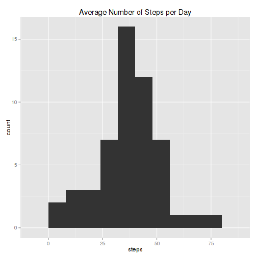
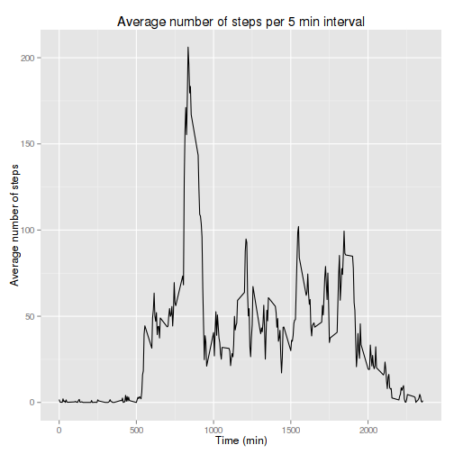
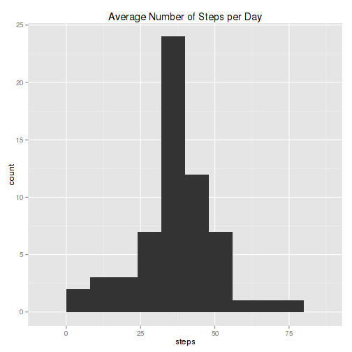
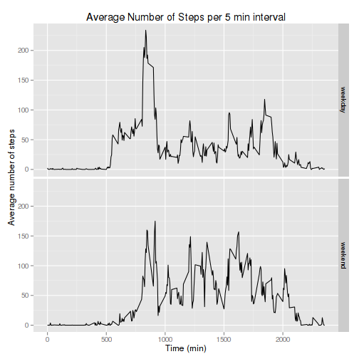

###*Loading and Processing the data

**1. Load the data**

We will unzip and load the data in file *activity.csv*. In order for the code to work, the markdown file should be in the same directory as the data file.

```r
      data <- read.csv(unzip("./activity.zip"), header = TRUE, sep=",")
```

**2. Transform date column to POSIX *Date* type. **

```r
      data$date <- as.Date(data$date)
```

###*What is mean total number of steps taken per day?

**1. Make a histogram of the total number of steps taken each day.**

In order to do this, data is aggregated by date and averaged by step. The value is assigned to variable *av_steps_day*. Then, a histogram of *av_steps_day* is plotted. I will use qplot from ggplot2 package to make the graphs, hence the library must be loaded.

```r
      library(ggplot2)  #Loading of ggplot2 library.
      av_steps_day <- aggregate(steps~date, data=data, FUN=mean)
      qplot(steps, data=av_steps_day, geom="histogram", binwidth=8, main="Average Number of Steps per Day")
```

 

**2. Calculate and report the mean and median total number of steps taken per day **

First the sum of all steps per day (i.e.: total) will be calculated. Then mean and median of these sums are obtained and printed to the console. 

```r
      total_steps_day <- aggregate(steps~date, data=data, FUN=sum)
      mean_total <- mean(total_steps_day$steps)
      median_total <- median(total_steps_day$steps)
      message(c("Mean total number of steps: ", mean_total))
```

```
## Mean total number of steps: 10766.1886792453
```

```r
      message(c("Median total number of steps: ", median_total))              
```

```
## Median total number of steps: 10765
```

###*What is the average daily activity pattern?

**1. Make a time series plot (i.e. type = "l") of the 5-minute interval (x-axis) and the average number of steps taken, averaged across all days (y-axis).**


```r
      time_series <- aggregate(steps~interval, data=data, FUN=mean)
      qplot(interval, steps, data=time_series, geom="line", main="Average number of steps per 5 min interval", ylab="Average number of steps", xlab="Time (min)")
```

 

**2.Which 5-minute interval, on average across all the days in the dataset, contains the maximum number of steps?**

```r
      max_position = which.max(time_series$steps)
      message(c("The maximum number of steps is in the interval ", max_position, ", which correspond to ", time_series$interval[max_position], " min."))
```

```
## The maximum number of steps is in the interval 104, which correspond to 835 min.
```
###*Imputing missing values

**1. Calculate and report the total number of missing values in the dataset (i.e. the total number of rows with NAs).**

There are no NAs either in *interval* or in *date*, so need to count NAs in steps.

```r
      message (c("There are ", sum(is.na(data$steps)), " missing values."))
```

```
## There are 2304 missing values.
```

**2. Devise a strategy for filling in all of the missing values in the dataset. The strategy does not need to be sophisticated. For example, you could use the mean/median for that day, or the mean for that 5-minute interval, etc.**

**3. Create a new dataset that is equal to the original dataset but with the missing data filled in. **

I will fill the missing value with the average number of steps in that interval, which was calculated in a previous exercise and is stored in the variable *time_series*. I will use a for loop checking for **NAs** in *steps*; If **NA** then the corresponding value for that interval will be extracted from *time_series* and changed in the new dataset *new_data*. 


```r
new_data <- data
indexes <- 1:nrow(data)
for (index in indexes)
{
      if (is.na(data$steps[index]))
      {
            new_data$steps[index] <- time_series$steps[which(time_series$interval==data$interval[index])]
      }
}
```

**4. Make a histogram of the total number of steps taken each day and Calculate and report the mean and median total number of steps taken per day. Do these values differ from the estimates from the first part of the assignment? What is the impact of imputing missing data on the estimates of the total daily number of steps?**

```r
      av_steps_day <- aggregate(steps~date, data=new_data, FUN=mean)
      qplot(steps, data=av_steps_day, geom="histogram", binwidth=8, main="Average Number of Steps per Day")
```

 

```r
      total_steps_day <- aggregate(steps~date, data=new_data, FUN=sum)
      mean_total <- mean(total_steps_day$steps)
      median_total <- median(total_steps_day$steps)
      message(c("Mean total number of steps: ", mean_total))
```

```
## Mean total number of steps: 10766.1886792453
```

```r
      message(c("Median total number of steps: ", median_total))              
```

```
## Median total number of steps: 10766.1886792453
```

Means are identical in the first part of the assigment and in this part.
Medians vary slightly. The new median is now equal to the mean, probably because the missing values were filled with averages obtained from the rest of the dataset.


###*Are there differences in activity patterns between weekdays and weekends?

**1. Create a new factor variable in the dataset with two levels – “weekday” and “weekend” indicating whether a given date is a weekday or weekend day.**

```r
      day_type <-""
      weekend_days <- c("Saturday", "Sunday")
      for (index in indexes)
      {
            if (sum(weekdays(data$date[index]) == weekend_days)>0)
                  {
                        day_type[index] = "weekend"
                  }
            else
                  day_type[index] = "weekday"
      }
      data <- cbind(data, day_type)   
```
**2. Make a panel plot containing a time series plot (i.e. type = "l") of the 5-minute interval (x-axis) and the average number of steps taken, averaged across all weekday days or weekend days (y-axis). See the README file in the GitHub repository to see an example of what this plot should look like using simulated data.**

```r
      weekday_dat<-aggregate(steps~interval, data=data, subset=day_type=="weekday", FUN=mean)
      weekend_dat<-aggregate(steps~interval, data=data, subset=day_type=="weekend", FUN=mean)
      weekday_dat$day_type <- "weekday"
      weekend_dat$day_type <- "weekend"
      qplot(interval, steps, data=rbind(weekend_dat, weekday_dat), geom="line", facets=day_type~., main="Average Number of Steps per 5 min interval", ylab="Average number of steps", xlab="Time (min)")
```

 
Actity clearly starts at a later interval in the weekend. It also ends later. In the mid-day intervals, the individual has an increased activity in the weekend as compared to the weekdays.
